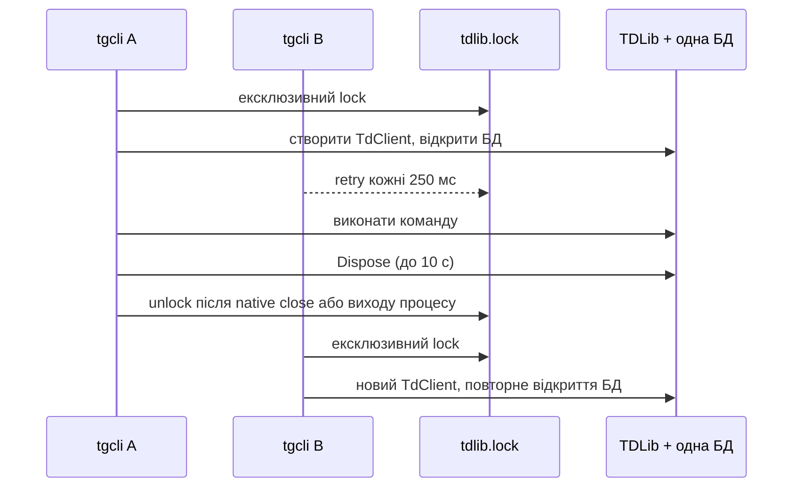

# Паралельність у `tgcli`

## MCP у робочому дереві (ще не випущено)

`tgcli mcp` створює один `TelegramSession` ліниво, під час першого Telegram tool call, і повторно використовує його. Каталог та discovery працюють без Telegram. Виклики tools виконуються послідовно; `request_timeout` (типово 60 с, максимум 300 с) охоплює чергу та роботу. Скасування припиняє очікування клієнта, але незавершена native-операція зберігає gate до свого завершення. MCP-запити каталогу не стоять у цій черзі.

Після EOF сервер скасовує роботу та чекає до 10 с на звільнення gate, потім до 10 с на native-закриття. Якщо native-клієнт ще працює, lock залишається до його фактичного закриття або завершення процесу. Звичайний CLI теж більше не віддає lock лише через вичерпання часу очікування закриття.

Кожен Desktop, CLI або IDE запускає власний MCP-процес. Спільний конфіг Codex CLI/Desktop не об'єднує процеси. Поки один MCP-процес володіє сесією, інший чекає `--lock-timeout` або отримує помилку з `--no-wait`. Закрийте активне підключення перед переходом до іншого клієнта або використовуйте незалежно авторизовані сесії. MCP не реалізує daemon/IPC. Докладніше: [MCP.md](MCP.md).

## Коротко

Зараз кілька викликів з однією `--session` **не працюють паралельно**. Кожен процес хоче створити власний `TdClient`, тому `tgcli` бере ексклюзивний lock на всю сесію й пропускає процеси по одному.

Це частково вимога TDLib: два клієнти не можуть одночасно відкрити ту саму локальну базу. Але **запити всередині одного клієнта TDLib є асинхронними й можуть виконуватися конкурентно**. Отже, проблема не в нездатності TDLib до паралельності, а в архітектурі «один CLI-виклик = один процес = один клієнт».

## Як це працює зараз

Конкретно:

- `CreateReadyAsync()` викликається практично кожною командою і щоразу створює новий `TdClient` ([TelegramSession.cs:28](TelegramSession.cs#L28)).
- До створення клієнта відкривається `tdlib.lock` з `FileShare.None`; очікування — polling раз на 250 мс ([TelegramSession.cs:244](TelegramSession.cs#L244)).
- Lock утримується протягом ініціалізації, авторизаційної готовності, усієї команди та закриття TDLib ([TelegramSession.cs:181](TelegramSession.cs#L181)).
- Типовий timeout lock — 30 с, у `diagnostics` — 5 с. Тому другий виклик не обов'язково дочекається першого: довга команда просто спричинить помилку timeout.

## Чому це погано

1. **Немає реальної паралельності:** короткий `message get` чекає завершення довгого export/search.
2. **Повторюється дорога робота:** кожна команда заново запускає receiver TDLib, відкриває БД, перевіряє authorization state і потім закриває клієнт.
3. **Нестабільна затримка:** час відповіді залежить від чужої команди; після timeout користувач отримує помилку замість результату.
4. **Погане масштабування:** `N` незалежних викликів утворюють послідовну чергу, але без спільного scheduler, пріоритетів, cancellation чи чесної черговості.
5. **Прибрати наш lock недостатньо:** тоді конфлікт лише переміститься всередину TDLib, яка сама відмовиться вдруге відкрити ту саму БД.

## Варіанти вирішення

| Варіант | Результат | Компроміс |
|---|---|---|
| **1. Один фоновий `tgcli daemon` + IPC** (рекомендовано) | Один довгоживучий `TdClient` володіє БД; CLI надсилають запити через Unix socket / named pipe. TDLib виконує незалежні запити конкурентно. | Найкраща швидкість і UX, але потрібні протокол, streaming output, cancellation та lifecycle daemon-а. |
| **2. Batch-команди в одному процесі** | Один процес і клієнт обслуговують багато запитів. `download-batch` уже дає конкурентне завантаження JSONL message references. | Потрібна окрема batch-команда для кожного сценарію; звичайні незалежні CLI-виклики не покращаться. |
| **3. Незалежно авторизована TDLib-сесія на worker** | Справжні незалежні процеси з різними authorization keys, `databaseDirectory` і `filesDirectory`. | Кожен worker є окремим Telegram-сеансом. Клонувати один `td.binlog` для конкурентної роботи небезпечно: можливий `AUTH_KEY_DUPLICATED` та інвалідація login. |
| **4. Поліпшити нинішню чергу** | Fail-fast за замовчуванням або явний broker/FIFO, кращі diagnostics і timeout-и. | Легше реалізувати, але команди все одно послідовні й платять startup/shutdown cost. |

Практичний напрям без daemon-а: додавати окремі batch-команди для операцій, де паралельність дає найбільшу користь, і виконувати їх над одним `TelegramSession`.

## Підстава щодо TDLib

- Офіційний опис: TDLib є [fully asynchronous; requests do not block each other](https://core.telegram.org/tdlib).
- `ClientManager.send` дозволено викликати з різних потоків; responses/updates треба приймати й застосовувати в порядку надходження: [ClientManager documentation](https://core.telegram.org/tdlib/docs/classtd_1_1_client_manager.html).
- Різні клієнти підтримуються з різними директоріями, а повторне відкриття однієї БД відхиляється: [офіційна відповідь maintainer-а TDLib](https://github.com/tdlib/td/issues/40).
